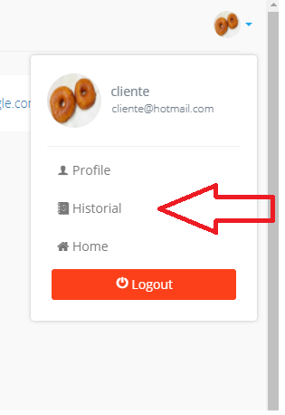
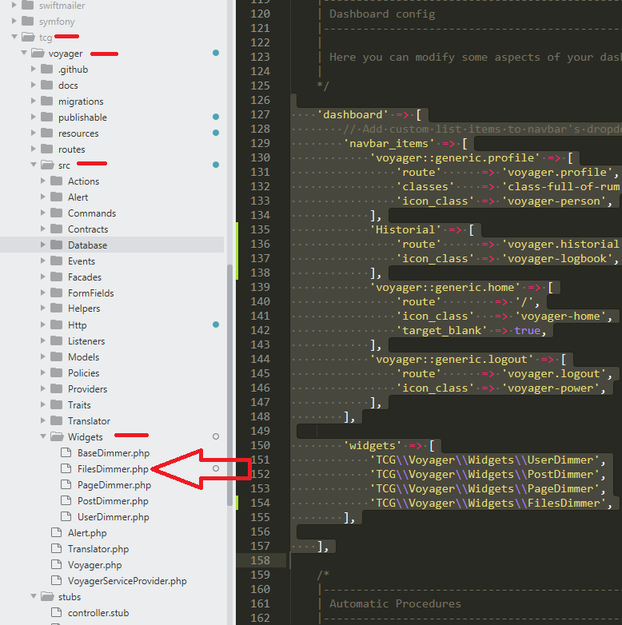

# Agregar opciones en el menu de profile

## Ovjetivo



1. project\config\voyager.php
2. project\vendor\tcg\voyager\src\Widgets\NuevoDimmer.php

Primero se debe ir a al primer archivo y agregar la linea 29 del siguiente codigo:


```bash
# Linea 127
    'dashboard' => [
        // Add custom list items to navbar's dropdown
        'navbar_items' => [
            'voyager::generic.profile' => [
                'route'      => 'voyager.profile',
                'classes'    => 'class-full-of-rum',
                'icon_class' => 'voyager-person',
            ],
            'Historial' => [
                'route'      => 'voyager.historial',
                'icon_class' => 'voyager-logbook',
            ],
            'voyager::generic.home' => [
                'route'        => '/',
                'icon_class'   => 'voyager-home',
                'target_blank' => true,
            ],
            'voyager::generic.logout' => [
                'route'      => 'voyager.logout',
                'icon_class' => 'voyager-power',
            ],
        ],

        'widgets' => [
            'TCG\\Voyager\\Widgets\\UserDimmer',
            'TCG\\Voyager\\Widgets\\PostDimmer',
            'TCG\\Voyager\\Widgets\\PageDimmer',
            'TCG\\Voyager\\Widgets\\FilesDimmer', #agrego esta linea
        ],

    ],

```


Segundo paso, se debe ir a la carpeta Widgets y crear el nuevo archivo llamado "FilesDimmer.php"




