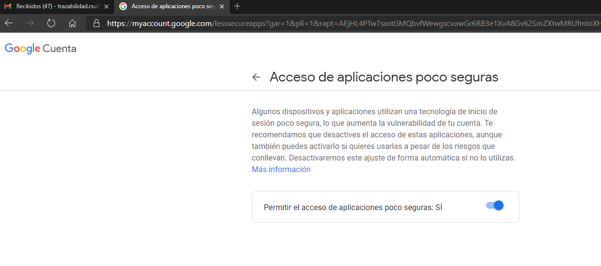

# Envio de emails desde laravel


Ref: [https://programmingfields.com/send-email-in-laravel-8-using-gmail-smtp/](https://programmingfields.com/send-email-in-laravel-8-using-gmail-smtp/)


### Paso 1: configurar server

Ahora toca configurar nuestra aplicación para indicarle que correo debe utilizar, su contraseña, que protocolo de comunicación, etc.

Sin tener nuestro servidor corriendo, nos dirigimos a nuestro archivo **.env** que se encuentra en la raíz de nuestro proyecto, y lo modificaremos de tal forma:

--- Se debe modificar el archivo .env de la siguiente manera:


```bash
# cerca de la linea 27
MAIL_MAILER=smtp
MAIL_HOST=smtp.gmail.com
MAIL_PORT=587
MAIL_USERNAME=trazabilidad.rsu@gmail.com
MAIL_PASSWORD=voocpvroiyjfdedd
MAIL_ENCRYPTION=tls
MAIL_FROM_ADDRESS=null
MAIL_FROM_NAME="${APP_NAME}"
```


### Paso 2: borrar cache del server

Una vez hecho esto, ejecutamos un comando que es conveniente utilizar cada vez que modifiquemos nuestro archivo .env:

```bash
php artisan config:clear
```

### Paso 3: Configurar cuenta de gmail

In this step, we will have to configure our Gmail account. Here, we will allow sending email through the configuration of **Gmail SMTP settings**. Also, to send email in Laravel 8 using the Gmail, we will have to create a password. Actually, we cannot use the actual password of the Google account to send email in Laravel 8. Hence, it will require an app password.

You will have to Login your Gmail account. Then go to the option **Manage your Google Account** inside the profile tab. Now, under the **Security** tab.  





### Paso 4: crear el elemento mail de laravel

Para ello se debe correr el siguiente comando:

```bash
php artisan make:mail FirstEmail
```


 Now, we have the mail class inside the **app/Mail** folder.


### Paso 5: Crear la vista


### Paso 6: Creación del controlador

 Para este ejemplo, vamos a crear un controlador que llamaremos **EmailController.php,** y añadiremos la siguiente función:

```bash
php artisan make:controller EmailController
```



```bash
<?php

namespace App\Http\Controllers;

use Illuminate\Http\Request;
use Illuminate\Support\Facades\Mail;
use App\Mail\FirstEmail;

class EmailController extends Controller
{
    public function sendEmail() {

        $to_email = "umesh.rana0269@gmail.com";

        Mail::to($to_email)->send(new FirstEmail);

        return "<p> Success! Your E-mail has been sent.</p>";

    }
}
```



### Paso 5: configurar ruta para el emails

Para enviar emails con nuestra aplicación laravel, modificaremos nuestro archivo web.php con las siguientes rutas:


```bash
....
use App\Http\Controllers\EmailController;
...
...

Route::get("send-email", [EmailController::class, "sendEmail"]);


```


