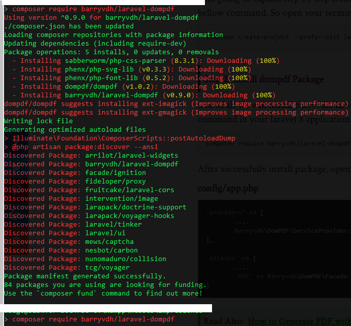

# Generando pdf desde laravel


Ref: [https://www.itsolutionstuff.com/post/laravel-8-pdf-laravel-8-generate-pdf-file-using-dompdfexample.html\#](https://www.itsolutionstuff.com/post/laravel-8-pdf-laravel-8-generate-pdf-file-using-dompdfexample.html#)


### Paso 1: instalar el paquete dompdf

```bash
 composer require barryvdh/laravel-dompdf
```



### Paso 2: agregar el provider y alias


```bash
'providers' => [
	....
	Barryvdh\DomPDF\ServiceProvider::class,
],
  
'aliases' => [
	....
	'PDF' => Barryvdh\DomPDF\Facade::class,
]

```


### Paso 3: agregar la ruta


```bash
...

use App\Http\Controllers\PDFController;
...
...
Route::get('generate-pdf', [PDFController::class, 'generatePDF']);
```


### Paso 4: crear el controller


```bash
<?php
  
namespace App\Http\Controllers;
  
use Illuminate\Http\Request;
use PDF;
  
class PDFController extends Controller
{
    /**
     * Display a listing of the resource.
     *
     * @return \Illuminate\Http\Response
     */
    public function generatePDF()
    {
        $data = [
            'title' => 'Welcome to ItSolutionStuff.com',
            'date' => date('m/d/Y')
        ];
          
        $pdf = PDF::loadView('myPDF', $data);
    
        return $pdf->download('itsolutionstuff.pdf');
    }
}
```


### Paso 5: crear la view para el pdf


```bash
<!DOCTYPE html>
<html>
<head>
    <title>Hi</title>
</head>
<body>
    <h1>{{ $title }}</h1>
    <p>{{ $date }}</p>
    <p>Lorem ipsum dolor sit amet, consectetur adipisicing elit, sed do eiusmod
    tempor incididunt ut labore et dolore magna aliqua. Ut enim ad minim veniam,
    quis nostrud exercitation ullamco laboris nisi ut aliquip ex ea commodo
    consequat. Duis aute irure dolor in reprehenderit in voluptate velit esse
    cillum dolore eu fugiat nulla pariatur. Excepteur sint occaecat cupidatat non
    proident, sunt in culpa qui officia deserunt mollit anim id est laborum.</p>
</body>
</html>
```


### Paso 6: probar

