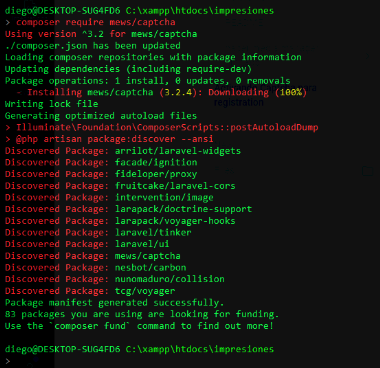
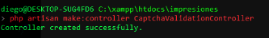

# Activando Captcha para registration

Ref: [https://www.tutsmake.com/laravel-8-captcha-tutorial-add-captcha-in-forms/](https://www.tutsmake.com/laravel-8-captcha-tutorial-add-captcha-in-forms/)

### Paso 1-  Instalar Captcha en el proyecto

Correr el comando



```text
composer require mews/captcha
```

### Paso 2- Regitrar el paquete Captcha

In this step, registered this package in laravel application. So, Open providers/config/app.php file and register the captcha service provider and aliases.

```text
'providers' => [
        ...
        ...
        ...
        Mews\Captcha\CaptchaServiceProvider::class,
    ]
 
'aliases' => [
    ...
    ...
    ...
    'Captcha' => Mews\Captcha\Facades\Captcha::class,
 
]
```

### Paso 3 - Configurar Captcha

In this step, open config/captcha.php file. And in this file you can enable or disable settings based on your requirement: Se debe ir a al archivo: vendor\mews\captcha\config\captcha.php:

```text
return [
    'default'   => [
        'length'    => 5,
        'width'     => 120,
        'height'    => 36,
        'quality'   => 90,
        'math'      => true, //Enable Math Captcha
        'expire'    => 60,   //Stateless/API captcha expiration
    ],
    // ...
];
```

### Paso 4 - crear ruta

In this step, open web.php file from routes direcotry. And update the following routes into web.php file:

```text
use App\Http\Controllers\CaptchaValidationController;
 
 
Route::get('contact-form-captcha', [CaptchaValidationController::class, 'index']);
Route::post('captcha-validation', [CaptchaValidationController::class, 'capthcaFormValidate']);
Route::get('reload-captcha', [CaptchaValidationController::class, 'reloadCaptcha']);
```

### Paso 5 - Crear el controller del form by Artisan command

In this step, run the following command on command prompt to create controller file:

```text
php artisan make:controller CaptchaValidationController
```



After that, go to app/http/controllers and open CaptchaValidationController.php file. And update the following code into it:

```text
<?php
 
namespace App\Http\Controllers;
use Illuminate\Http\Request;
 
class CaptchaValidationController extends Controller
{
    public function index()
    {
        return view('form-with-captcha');
    }
 
    public function capthcaFormValidate(Request $request)
    {
        $request->validate([
            'name' => 'required',
            'email' => 'required|email',
            'message' => 'required',
            'captcha' => 'required|captcha'
        ]);
    }
 
    public function reloadCaptcha()
    {
        return response()->json(['captcha'=> captcha_img()]);
    }
 
}
```

### Paso 6 - Crear el archivo blade

Now, create blade view file to display form with captcha challenge and submit to database. So, Go to resources/views and create form-with-captcha.blade.php and update the following code into it:

```text
<!DOCTYPE html>
<html>
<head>
<title>Laravel 8 Form Captcha Validation</title>
<meta name="csrf-token" content="{{ csrf_token() }}">
<link rel="stylesheet" href="https://stackpath.bootstrapcdn.com/bootstrap/4.5.2/css/bootstrap.min.css">
</head>
<body>
<div class="container mt-4">
@if(session('status'))
<div class="alert alert-success">
{{ session('status') }}
</div>
@endif
<div class="card">
<div class="card-header text-center font-weight-bold">
<h2>Laravel 8 Add Captcha in Form For Validation</h2>
</div>
<div class="card-body">
	@error('name')
<div class="alert alert-danger mt-1 mb-1">{{ $message }}</div>
@enderror
<form name="captcha-contact-us" id="captcha-contact-us" method="post" action="{{url('captcha-validation')}}">
@csrf
<div class="form-group">
<label for="exampleInputEmail1">Name</label>
<input type="text" id="name" name="name" class="@error('name') is-invalid @enderror form-control">
@error('name')
<div class="alert alert-danger mt-1 mb-1">{{ $message }}</div>
@enderror
</div>          
<div class="form-group">
<label for="exampleInputEmail1">Email</label>
<input type="email" id="email" name="email" class="@error('email') is-invalid @enderror form-control">
@error('email')
<div class="alert alert-danger mt-1 mb-1">{{ $message }}</div>
@enderror
</div>              
<div class="form-group">
<label for="exampleInputEmail1">Message</label>
<textarea name="message" class="@error('message') is-invalid @enderror form-control"></textarea>
@error('message')
<div class="alert alert-danger mt-1 mb-1">{{ $message }}</div>
@enderror
</div>
<div class="form-group mt-4 mb-4">
<div class="captcha">
<span>{!! captcha_img() !!}</span>
<button type="button" class="btn btn-danger" class="reload" id="reload">
↻
</button>
</div>
</div>
<div class="form-group mb-4">
<input id="captcha" type="text" class="form-control" placeholder="Enter Captcha" name="captcha">
</div>
<button type="submit" class="btn btn-primary">Submit</button>
</form>
</div>
</div>
</div>    
<script src="https://code.jquery.com/jquery-3.5.1.min.js" integrity="sha256-9/aliU8dGd2tb6OSsuzixeV4y/faTqgFtohetphbbj0=" crossorigin="anonymous"></script>
<script type="text/javascript">
$('#reload').click(function () {
$.ajax({
type: 'GET',
url: 'reload-captcha',
success: function (data) {
$(".captcha span").html(data.captcha);
}
});
});
</script>
</body>
</html>
```


